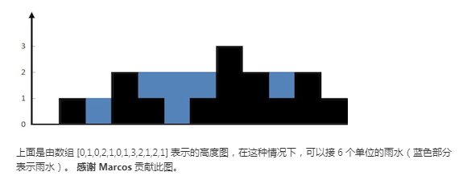

### 两数之和(1)

题目描述：

&emsp;&emsp;给定一个整数数组 nums 和一个目标值 target，请你在该数组中找出和为目标值的那 两个 整数，并返回他们的数组下标

[解题源码](TheSumOfTwoNumbers.java)
### 两数平方和()
题目描述：

&emsp;&emsp;判断一个数是否为两个数的平方和。
[解题源码](SumOfSquareNumbers.java)
### 两数相加(2)
题目描述 ：

&emsp;&emsp;给出两个 非空 的链表用来表示两个非负的整数。其中，它们各自的位数是按照 逆序 的方式存储的，并且它们的每个节点只能存储 一位 数字。如果，我们将这两个数相加起来，则会返回一个新的链表来表示它们的和。您可以假设除了数字 0 之外，这两个数都不会以 0 开头
[解题源码](TwoNumberSum.java)
### 无重复字符的最长子串(3)
题目描述：

&emsp;&emsp;给定一个字符串，请你找出其中不含有重复字符的 最长子串 的长度
[解题源码](FindTheLongerNoRepeatStringLength.java)
### 寻找两个有序数组的中位数(4)
题目描述：

&emsp;&emsp;给定两个大小为 m 和 n 的有序数组 nums1 和 nums2。
请你找出这两个有序数组的中位数，并且要求算法的时间复杂度为 O(log(m + n))。
你可以假设 nums1 和 nums2 不会同时为空。
[解题源码](FindMedianSortedArrays.java)
### 最长回文子串(5)
题目描述：

&emsp;&emsp;给定一个字符串 s，找到 s 中最长的回文子串。你可以假设 s 的最大长度为 1000
[解题源码](LongestPalindrome.java)
### 最长子序列(524)
题目描述：

&emsp;&emsp;给定一个字符串和一个字符串字典，找到字典里面最长的字符串，该字符串可以通过删除给定字符串的某些字符来得到。如果答案不止一个，返回长度最长且字典顺序最小的字符串。如果答案不存在，则返回空字符串
[解题源码](FindLongestWord.java)
### Z 字形变换(6)
题目描述：

&emsp;&emsp;将一个给定字符串根据给定的行数，以从上往下、从左到右进行 Z 字形排列。
[解题源码](ZStringConvert.java)
### 整数反转(7)
题目描述：

&emsp;&emsp;给出一个 32 位的有符号整数，你需要将这个整数中每位上的数字进行反转
[解题源码](ReverseInt.java)
### 字符串转换整数 (atoi)(8)
题目描述：

&emsp;&emsp;请你来实现一个 atoi 函数，使其能将字符串转换成整数。
[解题源码](StringToInt.java)
### 回文数(9)
题目描述：

&emsp;&emsp;判断一个整数是否是回文数。回文数是指正序（从左向右）和倒序（从右向左）读都是一样的整数
[解题源码](PalindromeInt.java)
### 10. 正则表达式匹配
题目描述：

&emsp;&emsp;给你一个字符串 s 和一个字符规律 p，请你来实现一个支持 '.' 和 '*' 的正则表达式匹配。
所谓匹配，是要涵盖 整个 字符串 s的，而不是部分字符串。
说明:

    '.' 匹配任意单个字符
    '*' 匹配零个或多个前面的那一个元素

    s 可能为空，且只包含从 a-z 的小写字母。
    p 可能为空，且只包含从 a-z 的小写字母，以及字符 . 和 *。

[解题源码](TwoStringIsMatch.java)
### 11. 盛最多水的容器
题目描述：

&emsp;&emsp;给定 n 个非负整数 a1，a2，...，an，每个数代表坐标中的一个点 (i, ai) 。
在坐标内画 n 条垂直线，垂直线 i 的两个端点分别为 (i, ai) 和 (i, 0)。
找出其中的两条线，使得它们与 x 轴共同构成的容器可以容纳最多的水
[解题源码](MaxArea.java)
### 12. 整数转罗马数字
题目描述：

&emsp;&emsp;罗马数字包含以下七种字符： I， V， X， L，C，D 和 M。

字符          数值
I             1
V             5
X             10
L             50
C             100
D             500
M             1000
例如， 罗马数字 2 写做 II ，即为两个并列的 1。12 写做 XII ，即为 X + II 。 27 写做  XXVII, 即为 XX + V + II 。

通常情况下，罗马数字中小的数字在大的数字的右边。但也存在特例，例如 4 不写做 IIII，而是 IV。数字 1 在数字 5 的左边，所表示的数等于大数 5 减小数 1 得到的数值 4 。同样地，数字 9 表示为 IX。这个特殊的规则只适用于以下六种情况：

I 可以放在 V (5) 和 X (10) 的左边，来表示 4 和 9。
X 可以放在 L (50) 和 C (100) 的左边，来表示 40 和 90。 
C 可以放在 D (500) 和 M (1000) 的左边，来表示 400 和 900。
给定一个整数，将其转为罗马数字。输入确保在 1 到 3999 的范围内。
[解题源码](IntToRoman.java)
### 13. 罗马数字转整数
题目描述：

&emsp;&emsp;罗马数字包含以下七种字符： I， V， X， L，C，D 和 M。

字符          数值
I             1
V             5
X             10
L             50
C             100
D             500
M             1000
例如， 罗马数字 2 写做 II ，即为两个并列的 1。12 写做 XII ，即为 X + II 。 27 写做  XXVII, 即为 XX + V + II 。

通常情况下，罗马数字中小的数字在大的数字的右边。但也存在特例，例如 4 不写做 IIII，而是 IV。数字 1 在数字 5 的左边，所表示的数等于大数 5 减小数 1 得到的数值 4 。同样地，数字 9 表示为 IX。这个特殊的规则只适用于以下六种情况：

I 可以放在 V (5) 和 X (10) 的左边，来表示 4 和 9。
X 可以放在 L (50) 和 C (100) 的左边，来表示 40 和 90。 
C 可以放在 D (500) 和 M (1000) 的左边，来表示 400 和 900。
给定一个整数，将其转为罗马数字。输入确保在 1 到 3999 的范围内。
[解题源码](RomanToInt.java)
### 14. 最长公共前缀
题目描述：

&emsp;&emsp;编写一个函数来查找字符串数组中的最长公共前缀。如果不存在公共前缀，返回空字符串 ""
[解题源码](LongestCommonPrefix.java)
### 15. 三数之和
题目描述：

&emsp;&emsp;给定一个包含 n 个整数的数组 nums，判断 nums 中是否存在三个元素 a，b，c ，使得 a + b + c = 0 ？找出所有满足条件且不重复的三元组。
注意：答案中不可以包含重复的三元组。
[解题源码](ThreeSum.java)
### 16. 最接近的三数之和
题目描述：

&emsp;&emsp;给定一个包括 n 个整数的数组 nums 和 一个目标值 target。找出 nums 中的三个整数，使得它们的和与 target 最接近。返回这三个数的和。假定每组输入只存在唯一答案。

    例如，给定数组 nums = [-1，2，1，-4], 和 target = 1.
    与 target 最接近的三个数的和为 2. (-1 + 2 + 1 = 2).
[解题源码](ThreeSumClosest.java)
### 17. 电话号码的字母组合
题目描述：

&emsp;&emsp;给定一个仅包含数字 2-9 的字符串，返回所有它能表示的字母组合。
            给出数字到字母的映射如下（与电话按键相同）。注意 1 不对应任何字母。

    输入："23"
    输出：["ad", "ae", "af", "bd", "be", "bf", "cd", "ce", "cf"].
 说明:
    尽管上面的答案是按字典序排列的，但是你可以任意选择答案输出的顺序。
[解题源码](LetterCombinations.java)
### 18. 四数之和
题目描述：

&emsp;&emsp;给定一个包含 n 个整数的数组 nums 和一个目标值 target，判断 nums 中是否存在四个元素 a，b，c 和 d ，使得 a + b + c + d 的值与 target 相等？找出所有满足条件且不重复的四元组。

    注意：
    答案中不可以包含重复的四元组。
[解题源码](FourSum.java)
### 19. 删除链表的倒数第N个节点
题目描述：

&emsp;&emsp;给定一个链表，删除链表的倒数第 n 个节点，并且返回链表的头结点。

    示例：
    给定一个链表: 1->2->3->4->5, 和 n = 2.
    当删除了倒数第二个节点后，链表变为 1->2->3->5.
    说明：
    给定的 n 保证是有效的。
    进阶：
    你能尝试使用一趟扫描实现吗？
[解题源码](RemoveNthFromEnd.java)
### 20. 有效的括号
题目描述：

&emsp;&emsp;给定一个只包括 '('，')'，'{'，'}'，'['，']' 的字符串，判断字符串是否有效。

     有效字符串需满足：

     左括号必须用相同类型的右括号闭合。
     左括号必须以正确的顺序闭合。
     注意空字符串可被认为是有效字符串
[解题源码](BracketIsValid.java)
### 21. 合并两个有序链表
题目描述：

&emsp;&emsp;将两个有序链表合并为一个新的有序链表并返回。新链表是通过拼接给定的两个链表的所有节点组成的。 

    示例：
    输入：1->2->4, 1->3->4
    输出：1->1->2->3->4->4
[解题源码](MergeTwoLists.java)
### 22. 括号生成
题目描述：

&emsp;&emsp;给出 n 代表生成括号的对数，请你写出一个函数，使其能够生成所有可能的并且有效的括号组合。
	例如，给出 n = 3，生成结果为：

	[
	  "((()))",
	  "(()())",
	  "(())()",
	  "()(())",
	  "()()()"
	]
[解题源码](BracketCreate.java)
### 24. 两两交换链表中的节点
题目描述：

&emsp;&emsp;给定一个链表，两两交换其中相邻的节点，并返回交换后的链表。

            你不能只是单纯的改变节点内部的值，而是需要实际的进行节点交换。

             

            示例:

            给定 1->2->3->4, 你应该返回 2->1->4->3.
[解题源码](SwapListNodePairs.java)
### 25. K 个一组翻转链表
题目描述：

&emsp;&emsp;给你一个链表，每 k 个节点一组进行翻转，请你返回翻转后的链表。

            k 是一个正整数，它的值小于或等于链表的长度。

            如果节点总数不是 k 的整数倍，那么请将最后剩余的节点保持原有顺序。

            示例 :

            给定这个链表：1->2->3->4->5

            当 k = 2 时，应当返回: 2->1->4->3->5

            当 k = 3 时，应当返回: 3->2->1->4->5

            说明 :

            你的算法只能使用常数的额外空间。
            你不能只是单纯的改变节点内部的值，而是需要实际的进行节点交换。
            在真实的面试中遇到过这道题？
[解题源码](ReverseKGroupListNode.java)
### 26. 删除排序数组中的重复项
题目描述：

&emsp;&emsp;给定一个排序数组，你需要在原地删除重复出现的元素，使得每个元素只出现一次，返回移除后数组的新长度。

            不要使用额外的数组空间，你必须在原地修改输入数组并在使用 O(1) 额外空间的条件下完成。

            示例 1:

            给定数组 nums = [1,1,2],

            函数应该返回新的长度 2, 并且原数组 nums 的前两个元素被修改为 1, 2。

            你不需要考虑数组中超出新长度后面的元素。
            示例 2:

            给定 nums = [0,0,1,1,1,2,2,3,3,4],

            函数应该返回新的长度 5, 并且原数组 nums 的前五个元素被修改为 0, 1, 2, 3, 4。

            你不需要考虑数组中超出新长度后面的元素。
            说明:

            为什么返回数值是整数，但输出的答案是数组呢?

            请注意，输入数组是以“引用”方式传递的，这意味着在函数里修改输入数组对于调用者是可见的。

            你可以想象内部操作如下:

            // nums 是以“引用”方式传递的。也就是说，不对实参做任何拷贝
            int len = removeDuplicates(nums);

            // 在函数里修改输入数组对于调用者是可见的。
            // 根据你的函数返回的长度, 它会打印出数组中该长度范围内的所有元素。
            for (int i = 0; i < len; i++) {
                print(nums[i]);
            }
[解题源码](RemoveDuplicates.java)
### 27. 移除元素
题目描述：

&emsp;&emsp;给定一个数组 nums 和一个值 val，你需要原地移除所有数值等于 val 的元素，返回移除后数组的新长度。

    不要使用额外的数组空间，你必须在原地修改输入数组并在使用 O(1) 额外空间的条件下完成。
    元素的顺序可以改变。你不需要考虑数组中超出新长度后面的元素。

[解题源码](RemoveElement.java)
### 28. 实现 strStr()
题目描述：

&emsp;&emsp;实现 strStr() 函数。
     给定一个 haystack 字符串和一个 needle 字符串，在 haystack 字符串中找出 needle 字符串出现的第一个位置 (从0开始)。如果不存在，则返回  -1

    说明:
    当 needle 是空字符串时，我们应当返回什么值呢？这是一个在面试中很好的问题。
    对于本题而言，当 needle 是空字符串时我们应当返回 0 。这与C语言的 strstr() 以及 Java的 indexOf() 定义相符。
[解题源码](ImplementStrStr.java)
### 29. 两数相除
题目描述：

&emsp;&emsp;给定两个整数，被除数 dividend 和除数 divisor。将两数相除，要求不使用乘法、除法和 mod 运算符。

	返回被除数 dividend 除以除数 divisor 得到的商。
	示例 1:
	输入: dividend = 10, divisor = 3
	输出: 3
	示例 2:
	输入: dividend = 7, divisor = -3
	输出: -2
	说明:
	被除数和除数均为 32 位有符号整数。
	除数不为 0。
	假设我们的环境只能存储 32 位有符号整数，其数值范围是 [−231,  231 − 1]。本题中，如果除法结果溢出，则返回 231 − 1。
[解题源码](DivideTwoInt.java)
### 30. 串联所有单词的子串
题目描述：

&emsp;&emsp;给定一个字符串 s 和一些长度相同的单词 words。找出 s 中恰好可以由 words 中所有单词串联形成的子串的起始位置。
注意子串要与 words 中的单词完全匹配，中间不能有其他字符，但不需要考虑 words 中单词串联的顺序。
[解题源码](FindWordSubstringInString.java)
### 31. 下一个排列
题目描述：

&emsp;&emsp;实现获取下一个排列的函数，算法需要将给定数字序列重新排列成字典序中下一个更大的排列。

	如果不存在下一个更大的排列，则将数字重新排列成最小的排列（即升序排列）。

	必须原地修改，只允许使用额外常数空间。

	以下是一些例子，输入位于左侧列，其相应输出位于右侧列。
	1,2,3 → 1,3,2
	3,2,1 → 1,2,3
	1,1,5 → 1,5,1
[解题源码](·.java)
### 32. 最长有效括号
题目描述：

&emsp;&emsp;给定一个只包含 '(' 和 ')' 的字符串，找出最长的包含有效括号的子串的长度。


[解题源码](LongestValidParentheses.java)
### 33. 搜索旋转排序数组
题目描述：

&emsp;&emsp;假设按照升序排序的数组在预先未知的某个点上进行了旋转。
( 例如，数组 [0,1,2,4,5,6,7] 可能变为 [4,5,6,7,0,1,2] )。
搜索一个给定的目标值，如果数组中存在这个目标值，则返回它的索引，否则返回 -1 。
你可以假设数组中不存在重复的元素。
你的算法时间复杂度必须是 O(log n) 级别。
```
示例 1:

输入: nums = [4,5,6,7,0,1,2], target = 0
输出: 4
示例 2:

输入: nums = [4,5,6,7,0,1,2], target = 3
输出: -1
```
[解题源码](SearchRotateSortArray.java)
### 34. 在排序数组中查找元素的第一个和最后一个位置
题目描述：

&emsp;&emsp;给定一个按照升序排列的整数数组 nums，和一个目标值 target。找出给定目标值在数组中的开始位置和结束位置。
你的算法时间复杂度必须是 O(log n) 级别。
如果数组中不存在目标值，返回 [-1, -1]。

```
示例 1:
输入: nums = [5,7,7,8,8,10], target = 8
输出: [3,4]
示例 2:

输入: nums = [5,7,7,8,8,10], target = 6
输出: [-1,-1]
```
[解题源码](SearchRangeFirstAndEnd.java)
### 35. 搜索插入位置
题目描述：

&emsp;&emsp;给定一个排序数组和一个目标值，在数组中找到目标值，并返回其索引。如果目标值不存在于数组中，返回它将会被按顺序插入的位置。
你可以假设数组中无重复元素。

```
示例 1:

输入: [1,3,5,6], 5
输出: 2
示例 2:

输入: [1,3,5,6], 2
输出: 1
示例 3:

输入: [1,3,5,6], 7
输出: 4
示例 4:

输入: [1,3,5,6], 0
输出: 0
```
[解题源码](SearchLocationToInsert.java)
### 36. 有效的数独
题目描述：

&emsp;&emsp;判断一个 9x9 的数独是否有效。只需要根据以下规则，验证已经填入的数字是否有效即可。
1. 数字 1-9 在每一行只能出现一次。
2. 数字 1-9 在每一列只能出现一次。
3. 数字 1-9 在每一个以粗实线分隔的 3x3 宫内只能出现一次。

[解题源码](IsValidSudoku.java)
### 37. 解数独
题目描述：

&emsp;&emsp;编写一个程序，通过已填充的空格来解决数独问题。
1. 数字 1-9 在每一行只能出现一次。
2. 数字 1-9 在每一列只能出现一次。
3. 数字 1-9 在每一个以粗实线分隔的 3x3 宫内只能出现一次。

[解题源码](SolveSudoku.java)
### 38. 报数
题目描述：

&emsp;&emsp;报数序列是一个整数序列，按照其中的整数的顺序进行报数，得到下一个数。其前五项如下：
```
1.     1
2.     11
3.     21
4.     1211
5.     111221

1 被读作  "one 1"  ("一个一") , 即 11。
11 被读作 "two 1s" ("两个一"）, 即 21。
21 被读作 "one 2",  "one 1" （"一个二" ,  "一个一") , 即 1211。
给定一个正整数 n（1 ≤ n ≤ 30），输出报数序列的第 n 项。
注意：整数顺序将表示为一个字符串。
示例 1:
    输入: 1
    输出: "1"
    示例 2:

    输入: 4
    输出: "1211"
```
[解题源码](CountAndSay.java)
### 39. 组合总和
题目描述：

&emsp;&emsp;给定一个无重复元素的数组 candidates 和一个目标数 target ，找出 candidates 中所有可以使数字和为 target 的组合。
            candidates 中的数字可以无限制重复被选取。
            说明：
            所有数字（包括 target）都是正整数。
            解集不能包含重复的组合。
```
示例 1:

输入: candidates = [2,3,6,7], target = 7,
所求解集为:
[
  [7],
  [2,2,3]
]
示例 2:

输入: candidates = [2,3,5], target = 8,
所求解集为:
[
  [2,2,2,2],
  [2,3,3],
  [3,5]
]
```
[解题源码](CombinationSum.java)
### 40. 组合总和 II
题目描述：

&emsp;&emsp;给定一个数组 candidates 和一个目标数 target ，找出 candidates 中所有可以使数字和为 target 的组合。
            candidates 中的每个数字在每个组合中只能使用一次。
            说明：
            所有数字（包括 target）都是正整数。
            解集不能包含重复的组合。
```
示例 1:

输入: candidates = [10,1,2,7,6,1,5], target = 8,
所求解集为:
[
  [1, 7],
  [1, 2, 5],
  [2, 6],
  [1, 1, 6]
]
输入: candidates = [2,5,2,1,2], target = 5,
所求解集为:
[
  [1,2,2],
  [5]
]
```
[解题源码](CombinationSum2.java)
### 41. 缺失的第一个正数
题目描述：

&emsp;&emsp;给定一个未排序的整数数组，找出其中没有出现的最小的正整数。
```
示例 1:

输入: [1,2,0]
输出: 3
示例 2:

输入: [3,4,-1,1]
输出: 2
示例 3:

输入: [7,8,9,11,12]
输出: 1
```
你的算法的时间复杂度应为O(n)，并且只能使用常数级别的空间。

[解题源码](FirstMissingPositive.java)
### 42. 接雨水
题目描述：

&emsp;&emsp;给定 n 个非负整数表示每个宽度为 1 的柱子的高度图，计算按此排列的柱子，下雨之后能接多少雨水

```
示例:

输入: [0,1,0,2,1,0,1,3,2,1,2,1]
输出: 6
```

[解题源码](TrapRainWater.java)
### 43. 字符串相乘
题目描述：

&emsp;&emsp;给定两个以字符串形式表示的非负整数 num1 和 num2，返回 num1 和 num2 的乘积，它们的乘积也表示为字符串形式。
```
示例 1:

输入: num1 = "2", num2 = "3"
输出: "6"
示例 2:

输入: num1 = "123", num2 = "456"
输出: "56088"
```
说明：

- num1 和 num2 的长度小于110。
- num1 和 num2 只包含数字 0-9。
- num1 和 num2 均不以零开头，除非是数字 0 本身。
- 不能使用任何标准库的大数类型（比如 BigInteger）或直接将输入转换为整数来处理。

[解题源码](MultiplyString.java)
### 46. Permutations
题目描述：

&emsp;&emsp;给定一个没有重复数字的序列，返回其所有可能的全排列。
 示例:

 输入: [1,2,3]
输出:
[
  [1,2,3],
  [1,3,2],
  [2,1,3],
  [2,3,1],
  [3,1,2],
  [3,2,1]
]
 Related Topics 回溯算法

[解题源码](_46_Permutations.java)
### 48. Rotate Image
题目描述：

&emsp;&emsp;给定一个 n × n 的二维矩阵表示一个图像。
 将图像顺时针旋转 90 度。

 说明：

 你必须在原地旋转图像，这意味着你需要直接修改输入的二维矩阵。请不要使用另一个矩阵来旋转图像。

 示例 1:

 给定 matrix =
[
  [1,2,3],
  [4,5,6],
  [7,8,9]
],

原地旋转输入矩阵，使其变为:
[
  [7,4,1],
  [8,5,2],
  [9,6,3]
]


 示例 2:

 给定 matrix =
[
  [ 5, 1, 9,11],
  [ 2, 4, 8,10],
  [13, 3, 6, 7],
  [15,14,12,16]
],

原地旋转输入矩阵，使其变为:
[
  [15,13, 2, 5],
  [14, 3, 4, 1],
  [12, 6, 8, 9],
  [16, 7,10,11]
]

 Related Topics 数组

[解题源码](_48_RotateImage.java)
### 49. 字母异位词分组
题目描述：

&emsp;&emsp;给定一个字符串数组，将字母异位词组合在一起。字母异位词指字母相同，但排列不同的字符串。

 示例:

 输入: ["eat", "tea", "tan", "ate", "nat", "bat"],
输出:
[
  ["ate","eat","tea"],
  ["nat","tan"],
  ["bat"]
]

 说明：


 所有输入均为小写字母。
 不考虑答案输出的顺序。

 Related Topics 哈希表 字符串
[解题源码](_49_GroupAnagrams.java)
### 50. Pow(x, n)
题目描述：

&emsp;&emsp;实现 pow(x, n) ，即计算 x 的 n 次幂函数。

示例 1:

输入: 2.00000, 10
输出: 1024.00000


示例 2:

输入: 2.10000, 3
输出: 9.26100


示例 3:

输入: 2.00000, -2
输出: 0.25000
解释: 2-2 = 1/22 = 1/4 = 0.25

说明:


-100.0 < x < 100.0
n 是 32 位有符号整数，其数值范围是 [−231, 231 − 1] 。

Related Topics 数学 二分查找
[解题源码](_50_PowxN.java)
### 51. N-Queens
题目描述：

&emsp;&emsp;实现 pow(x, n) ，即计算 x 的 n 次幂函数。

示例 1:

输入: 2.00000, 10
输出: 1024.00000


示例 2:

输入: 2.10000, 3
输出: 9.26100


示例 3:

输入: 2.00000, -2
输出: 0.25000
解释: 2-2 = 1/22 = 1/4 = 0.25

说明:


-100.0 < x < 100.0
n 是 32 位有符号整数，其数值范围是 [−231, 231 − 1] 。

Related Topics 数学 二分查找
[解题源码](_50_PowxN.java)
### 53. Maximum Subarray
题目描述：

&emsp;&emsp;给定一个整数数组 nums ，找到一个具有最大和的连续子数组（子数组最少包含一个元素），返回其最大和。

示例:

输入: [-2,1,-3,4,-1,2,1,-5,4],
输出: 6
解释: 连续子数组 [4,-1,2,1] 的和最大，为 6。


进阶:

如果你已经实现复杂度为 O(n) 的解法，尝试使用更为精妙的分治法求解。
Related Topics 数组 分治算法 动态规划
[解题源码](_53_MaximumSubarray.java)
### 54. Spiral Matrix
题目描述：

&emsp;&emsp;给定一个包含 m x n 个元素的矩阵（m 行, n 列），请按照顺时针螺旋顺序，返回矩阵中的所有元素。

示例 1:

输入:
[
 [ 1, 2, 3 ],
 [ 4, 5, 6 ],
 [ 7, 8, 9 ]
]
输出: [1,2,3,6,9,8,7,4,5]

示例 2:
输入:
[
  [1, 2, 3, 4],
  [5, 6, 7, 8],
  [9,10,11,12]
]
输出: [1,2,3,4,8,12,11,10,9,5,6,7]

Related Topics 数组
[解题源码](_54_SpiralMatrix.java)
### 54. Spiral Matrix
题目描述：

&emsp;&emsp;给出一个区间的集合，请合并所有重叠的区间。

示例 1:

输入: [[1,3],[2,6],[8,10],[15,18]]
输出: [[1,6],[8,10],[15,18]]
解释: 区间 [1,3] 和 [2,6] 重叠, 将它们合并为 [1,6].

示例 2:
输入: [[1,4],[4,5]]
输出: [[1,5]]
解释: 区间 [1,4] 和 [4,5] 可被视为重叠区间。
Related Topics 排序 数组
[解题源码](_56_MergeIntervals.java)


